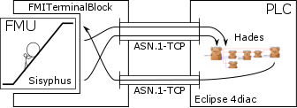
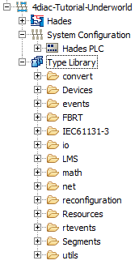
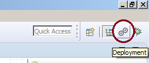
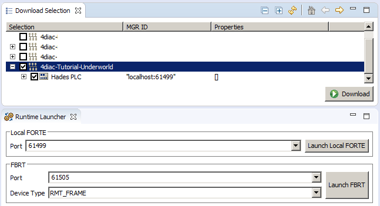
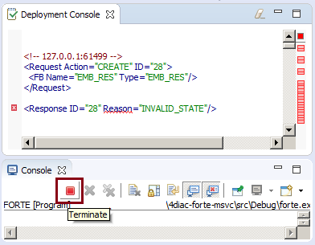
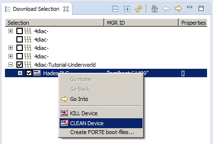

Quick Start Tutorial
====================

The following tutorial demonstrates the usage of FMITerminalBlock in a Controller Hardware in the Loop (CHIL) and Hardware in the Loop (HIL) setup. It is intended to quickly outline the operation of all involved software components but does not describe them in details. The model is created and exported via [OpenModelica](https://www.openmodelica.org/), the controller is implemented in [Eclipse 4diac](http://www.eclipse.org/4diac/) and a hardware is emulated via [Modbus simulator](https://sourceforge.net/projects/modrssim/). Please make sure that all tools including [FMITerminalBlock](installation.md) are available beforehand. Please refer to the documentation of the software tools in general and the [FMITerminalBlock usage](usage.md) documentation in particular for a detailed description.

## Model and Pure Virtual Simulation

At the beginning, the behavior of interest is modeled. For the current tutorial, a use case which does not introduce too many technical details was chosen. The mythological character [Sisyphus](https://en.wikipedia.org/wiki/Sisyphus), king of Ephyra is forced to roll a bolder up a hill. Nearly on top, the bolder comes back and the action is repeated. The following model simulates the situation. The Sisyphus block takes the vertical speed and outputs a flag as soon as the bottom or top is nearly reached. Additionally, the current height is presented. The Hades block reads the flags and changes the vertical speed of Sisyphus accordingly.


The model files are included in the [model](tutorial-data/model) directory. One can simulate the pure virtual simulation in order to check the functionality of the blocks. The output of the pure virtual simulation is printed in the following figure.


## Model Export as FMU

In the next steps, the Hades block should be substituted by a controller implementation and the Sisyphus block is executed as virtual component. Regardless of what tool is used to model the virtual component, it needs to be exported as FMU for model exchange. OpenModelica, for instance, offers a menu entry for exporting models as FMU. Make sure that the platform of the FMU corresponds to the platform of FMITerminalBlock. For instance, if FMITerminalBlock was compiled as 32-bit windows application, the FMU must directly support 32-bit windows systems. For 32-bit windows systems, the Sisyphus FMU is also [available](tutorial-data/model/Sisyphus.fmu).


FMUs are zip compressed archives which contain all files necessary to include the model. FMITerminalBlock requires a FMU to be available in extracted form. Hence, one needs to extract the .fmu file via her/his favourite archive tool.

## Controller Design

The controller is designed in Eclipse 4diac, an IEC 61499-based software PLC. FMITerminalBlock will read the exported model and connect to the PLC. Therefore, FMITerminalBlock needs to synchronize the time with the computer clock and needs to map the in- and outputs of the FMU to the out- and inputs of the controller. The following figure illustrates the experimental setup. 



Eclipse 4diac provides a system centric view of automation systems which possibly include several controllers with distributed control logic. For the sake of simplicity, only a single PLC device is configured. Please consider the [Eclipse 4diac](http://www.eclipse.org/4diac/en_help.php) documentation for detailed information on how to create new systems and control logic. In the tutorial, the functionality of the Hades block is configured via predefined function blocks. A function block in IEC 61499-based systems has two types of in- and outputs. The first kind are variable outputs which are similar to in- and outputs of IEC 61131-based systems. The other kind of outputs are event outputs which control the execution of a function block. Event in- and outputs are drawn at the top of a function block and variable in- and outputs are drawn at the bottom. The following figure shows a screenshot of the implemented control logic. The control system may also be directly [downloaded from the repository](tutorial-data/controller/4diac-tutorial-underworld.zip).


The server function block on the left hand side of the screenshot receives all exported values from FMITerminalBlock. The first value is set at RD_1, the second value on RD_2 and so on. In particular, RD_1 is set when Sisyphus nearly reaches the top and RD_2 is set when he nearly reaches the bottom. RD_3 holds the current height for debugging purpose. Conversion function blocks such as LREAL2LREAL and REAL2REAL set the in- and output types in case Eclipse 4diac cannot automatically deduce them. The RS flip-flop called UpDownStorage keeps track of the current direction and the following selector sets the actual speed set-point. Finally, the server function block on the right hand side of the graphic waits for incoming connection of FMITerminalBlock and sends the computational results to the model. Since the standard function block library does not contain any server function block with just one input, the output RD_1 is left unconnected. Note that every server function block handles a separate connection to FMITerminalBlock. FMITerminalBlock is able to handle an arbitrary amount of connections concurrently. Also simultaneous connections to different devices are feasible. Nevertheless, every connection currently handles only one data flow direction.

## Start and Program the Controller 

First, the Eclipse 4diac Project needs to be imported into the IDE. One way of importing external projects is to press the file menu item "Import ..." and select General/"Existing Projects Into Workspace". One may directly select the archive file or the extracted directory for import. As soon as the project is imported, the entities of the project will be displayed in the "System Explorer" view.



The application which is preceded by the blue icon can be opened by double-clicking on the entry called Hades. Eclipse 4diac IDE provides several perspectives which group available view elements. One can switch the perspective by pressing the buttons at the top right corner of the window. In order to start and program a software PLC one needs to switch to the deployment perspective.



In the deployment perspective, the PLC or project needs to be selected for programming. Software download is started via the download button in the download selection view. In order to program the software PLC, Eclipse 4diac IDE connects to the management port of the PLC instance and writes the function block configuration. It does not start a new PLC instance not erases any previous configuration. Hence, in most cases the PLC instance has to be started beforehand. The "Launch Local FORTE" button directly starts the configured default instance of the Eclipse 4diac FORTE software PLC. Another implementation which may be used to create HMIs is also available via the "Launch FBRT" button. The current tutorial only uses Eclipse 4diac FORTE instances.



The program was downloaded successfully if the "Deployment Console" view prints a wall of text (XML) without highlighting any error messages. Some error messages may be shown in case the PLC instance was already programmed. A programmed PLC is usually indicated by error messages such as ```<Response ID="..." Reason="INVALID_STATE"/>``` and may be fixed by restarting the PLC instance. A locally launched PLC instance may be stopped via the terminate button of the "Console" view.



Alternatively, a "Clean Device" entry in the context menu of the PLC in the "Download Selection" view also wipes the configuration and allows a rapid re-programming. 



Eclipse 4diac FORTE PLC may be compiled to read a given startup configuration file. Per default, the file is called ```forte.fboot```. In case the file is present and contains the correct version of the PLC configuration, no manual download is necessary. If the configuration was changed, the device needs to be cleaned and the updated configuration needs to be downloaded again.

