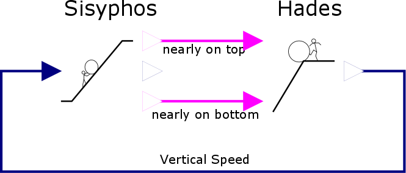
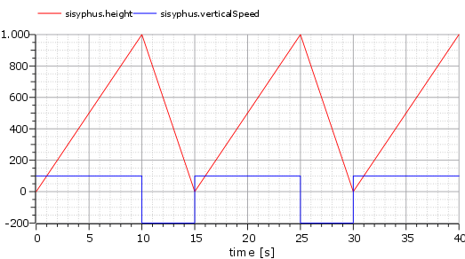
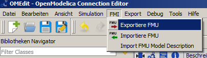

Quick Start Tutorial
====================

The following tutorial demonstrates the usage of FMITerminalBlock in a Controller Hardware in the Loop (CHIL) and Hardware in the Loop (HIL) setup. It is intended to quickly outline the operation of all involved software components but does not describe them in details. The model is created exported via [OpenModelica](https://www.openmodelica.org/), the controller is implemented in [Eclipse 4diac](http://www.eclipse.org/4diac/) and a hardware is emulated via [Modbus simulator](https://sourceforge.net/projects/modrssim/). Please make sure that all tools including [FMITerminalBlock](installation.md) are available beforehand. Please refer to the documentation of the software tools and the [FMITerminalBlock usage](usage.md) documentation in particular for a detailed description.

## Model and Pure Virtual Simulation

At the beginning, the behavior of interest is modeled. For the current tutorial, a use case which does not introduce too many technical details was chosen. The mythological character [Sisyphus](https://en.wikipedia.org/wiki/Sisyphus), king of Ephyra is forced to roll a bolder up a hill. Nearly on top, the bolder comes back and the action is repeated. The following model simulates the situation. The Sisyphus block takes the vertical position and outputs a flag as soon as the bottom or top is nearly reached. Additionally, the current height is presented. The Hades block reads the flags and changes the vertical speed of Sisyphus accordingly.

The model files are included in the [model](tutorial-data/model) directory. One can simulate the pure virtual simulation in order to check the functionality of the blocks. The output of the pure virtual simulation is printed in the following figure.

## Exporting the Model as FMU

In the next steps, the Hades block should be substituted by a controller implementation and the Sisyphus block is executed as virtual component. Regardless of what tool is used to model the virtual component, it needs to be exported as FMU for model exchange. OpenModelica, for instance, offers a menu entry for exporting models as FMU. Make sure that the platform of the FMU corresponds to the platform of FMITerminalBlock. For instance, if FMITerminalBlock was compiled as 32-bit windows application, the FMU must directly support 32-bit windows systems. For 32-bit windows systems, the Sisyphus FMU is also [available](tutorial-data/model/Sisyphus.fmu).

FMUs are zip compressed archives which contain all files which are necessary to include the model. FMITerminalBlock requires a FMU to be available in extracted form. Hence, one needs to extract the .fmu file via her/his favourite archive tool.

